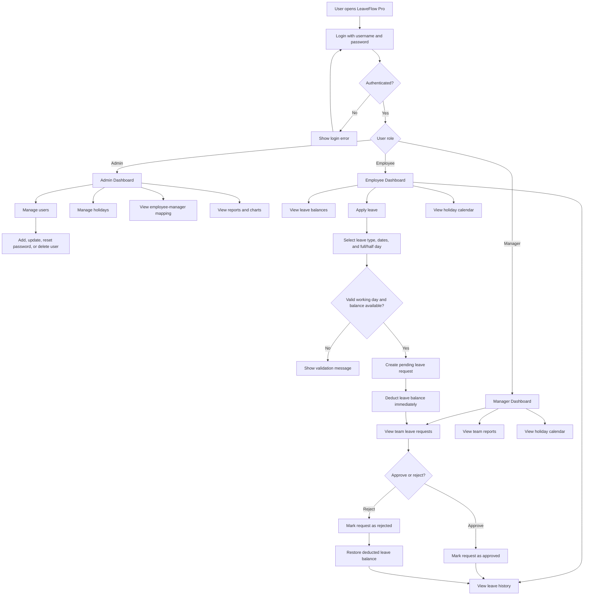

# leaveflow-pro
 LeaveFlow Pro is a role-based leave management system built with Streamlit, FastAPI, and SQLite. It supports admin, manager, and employee dashboards, leave requests, approvals, balance tracking, holiday calendar, reports, and persistent data storage.

# LeaveFlow Pro

LeaveFlow Pro is a role-based leave management system built with **FastAPI**, **Streamlit**, and **SQLite**. It provides separate dashboards for Admin, Manager, and Employee users, with leave balance tracking, approval workflows, holiday calendars, employee management, reports, and persistent database storage.

## Features

- Role-based login for Admin, Manager, and Employee
- Admin dashboard with employee count, manager count, total strength, charts, and reports
- Add, update, reset password, and delete users
- Auto-generated employee IDs:
  - Managers: `GENAIM1150...`
  - Employees: `GENAIE2650...`
- Manager-to-employee mapping view
- Leave request submission with full-day and half-day support
- Leave balance deduction during request submission
- Leave balance restoration when a request is rejected
- Manager approval and rejection workflow
- 2026 holiday calendar
- SQLite database storage so data is not lost after restart
- Clean professional Streamlit UI

## System Flow Chart



## Default Login

```text
Username: admin
Password: 123
```

Demo users are also available:

```text
manager / 123
employee / 123
```

## Tech Stack

- Frontend: Streamlit
- Backend: FastAPI
- Database: SQLite
- Language: Python

## Project Files

```text
backend.py      FastAPI backend with SQLite database logic
frontend.py     Streamlit frontend dashboard
leaveflow.db    SQLite database file created automatically
```

## How To Run

Install the required packages:

```bash
pip install fastapi uvicorn streamlit pandas requests
```

Start the backend:

```bash
uvicorn backend:app --reload
```

Start the frontend in another terminal:

```bash
streamlit run frontend.py
```

Then open the Streamlit URL shown in the terminal.

## Leave Balance Rules

Default balances for managers and employees:

```text
Earned Leave: 10
Sick Leave: 12
Casual Leave: 6
```

When an employee applies for leave, the balance is reduced immediately. If the manager approves the request, no further balance change happens. If the manager rejects the request, the deducted balance is added back automatically.

## Roles

Admin can manage users, holidays, employee-manager mapping, leave reports, and organization dashboards.

Manager can view team requests, approve or reject leave, inspect reports, and view the holiday calendar.

Employee can apply for leave, view leave history, track balances, and view the holiday calendar.
